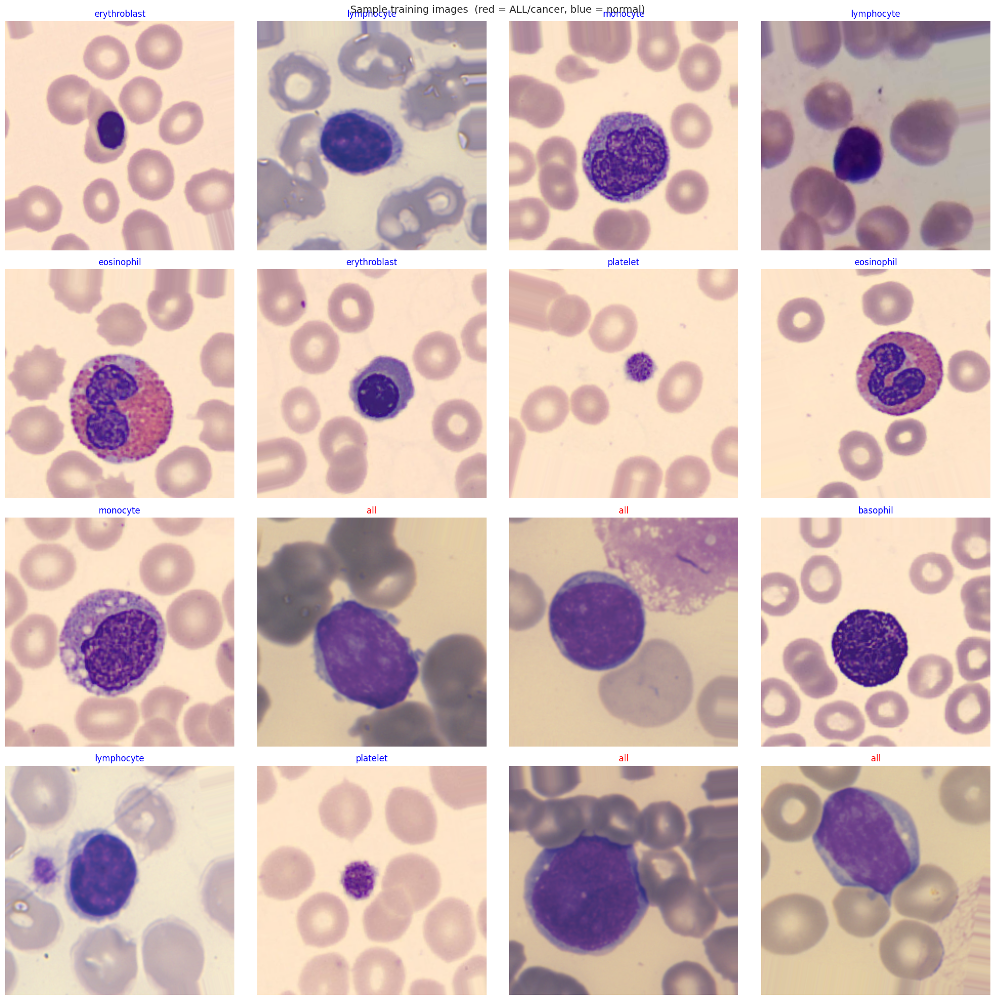
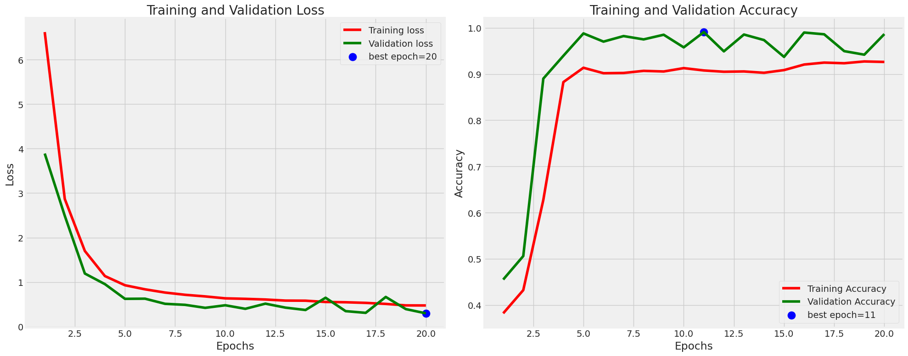
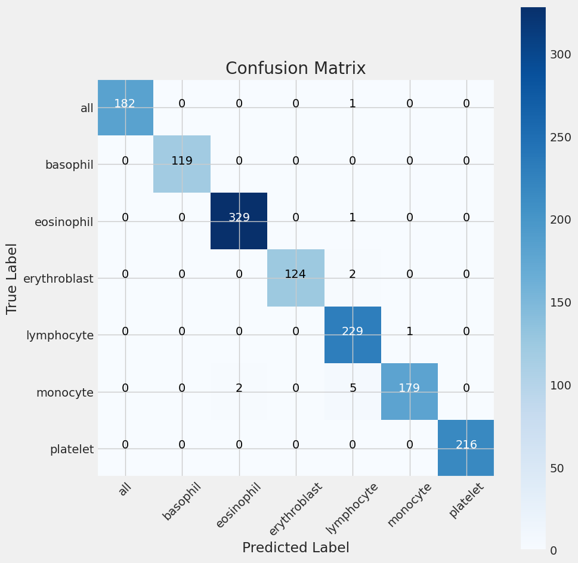

# 🩸 LeukaScan — Multi-Dataset Blood Cancer Detection

An AI-powered deep learning system for detecting **Acute Lymphoblastic Leukemia (ALL)** from microscopic blood-cell images.

LeukaScan was developed as part of a medical imaging and computer vision research project focused on distinguishing leukemia cells from healthy white blood cells using transfer learning and multi-dataset training. Rather than relying on a single dataset, the project combines multiple publicly available blood-cell datasets to improve robustness and generalization.

---

# 📸 Results Preview

> Add your screenshots in the `/images` folder and update the paths below.

## Sample Blood Cell Images



Examples of training images from the merged dataset pipeline. Cancerous lymphoblasts (ALL) are learned alongside multiple healthy blood-cell types.

---

## Training Curves



Training and validation metrics across epochs showing stable convergence and minimal overfitting.

---

## Confusion Matrix



Confusion matrix generated on the held-out test set.

---

# 🎯 Project Goal

Acute Lymphoblastic Leukemia (ALL) is one of the most common blood cancers and requires early diagnosis for effective treatment.

The objective of this project was to build a computer vision model capable of:

* Detecting ALL cells from blood smear images
* Learning from multiple public datasets
* Generalizing across different laboratories and image acquisition conditions
* Serving as a foundation for future deployment through a web application or REST API

---

# 📊 Final Results

## Test Performance

| Metric    | Score      |
| --------- | ---------- |
| Accuracy  | **99.14%** |
| Precision | **99%**    |
| Recall    | **99%**    |
| F1 Score  | **99%**    |

### Dataset Evaluation

```text
Train Accuracy : 99.51%
Validation Accuracy : 98.66%
Test Accuracy : 99.14%
```

### Class-wise Performance

| Class        | Precision | Recall | F1 Score |
| ------------ | --------- | ------ | -------- |
| ALL          | 1.00      | 0.99   | 1.00     |
| Basophil     | 1.00      | 1.00   | 1.00     |
| Eosinophil   | 0.99      | 1.00   | 1.00     |
| Erythroblast | 1.00      | 0.98   | 0.99     |
| Lymphocyte   | 0.96      | 1.00   | 0.98     |
| Monocyte     | 0.99      | 0.96   | 0.98     |
| Platelet     | 1.00      | 1.00   | 1.00     |

---

# 🧬 Datasets Used

The final training dataset was assembled by combining multiple publicly available blood-cell datasets.

## Bodzás Leukemia Dataset

Classes:

* Lymphoblast (ALL)
* Lymphocyte (Normal)

Purpose:

* Primary source of leukemia samples.

---

## PBC Barcelona Dataset

Classes:

* Basophil
* Eosinophil
* Erythroblast
* Lymphocyte
* Monocyte
* Platelet

Purpose:

* Additional healthy blood-cell diversity.

---

## Raabin-WBC Dataset

Classes:

* Basophil
* Eosinophil
* Lymphocyte
* Monocyte

Purpose:

* Improved generalization across imaging conditions.

---

# 🏗️ Model Architecture

The final model uses transfer learning with EfficientNetB3.

```python
EfficientNetB3
↓
BatchNormalization
↓
Dense(256)
↓
Dropout(0.45)
↓
Softmax
```

### Training Configuration

```python
IMG_SIZE = (224, 224)
BATCH_SIZE = 16
EPOCHS = 20
SEED = 123
```

### Optimizer

```python
Adamax(learning_rate=0.001)
```

### Loss Function

```python
Categorical Crossentropy
```

---

# 🔄 Data Augmentation

To improve robustness, training images undergo:

* Random rotation
* Horizontal flipping
* Width shifting
* Height shifting
* Zoom augmentation

These augmentations help the model generalize across different microscope settings and laboratories.

---

# ⚠️ Challenges Encountered

This project evolved significantly during development.

## Dataset Acquisition Problems

Several datasets initially considered for training were eventually discarded due to:

* Broken download links
* Incomplete metadata
* Preprocessing failures
* Incompatible formats
* Difficult integration into Kaggle workflows

As a result, the project pivoted toward datasets that were easier to reproduce and maintain.

---

## Class Imbalance

After merging datasets, healthy blood-cell samples greatly outnumbered leukemia samples.

```text
Healthy Cells >> Leukemia Cells
```

Several solutions were considered:

* Class weighting
* Oversampling
* Focal loss
* Undersampling

### Final Decision

Due to Kaggle compute limits and project deadlines:

* Leukemia samples were preserved.
* Lymphocytes were capped at 3000 samples.
* Other healthy classes were retained.

This improved balance without introducing synthetic data.

---

## Dataset Integration Challenges

Each dataset used different:

* Folder structures
* Naming conventions
* Class labels

A custom dataset discovery system was developed to:

* Automatically locate datasets
* Standardize labels
* Merge them into a unified training dataframe

---

## Data Storage Challenges

The Bodzás dataset proved difficult to manage directly inside Kaggle.

Several approaches were attempted:

* Direct uploads
* Kaggle datasets
* Manual packaging

### Final Decision

A Google Drive service-account workflow was implemented.

The notebook automatically:

1. Downloads the dataset
2. Extracts it
3. Integrates it into the training pipeline

This significantly improved reproducibility.

---

# 📌 Current Limitations

Although the model achieved strong performance, several limitations remain.

## Possible Dataset Leakage

The final dataset was assembled by combining multiple public blood-cell datasets and then performing a random train/validation/test split.

This introduces the possibility of dataset leakage because:

* Similar samples from the same source distribution may appear in multiple splits.
* Some datasets do not provide patient identifiers.
* Cross-dataset generalization was not explicitly evaluated.

While no intentional duplicate images were used, the reported performance may be optimistic compared to real-world deployment.

This is currently the most significant methodological limitation of the project.

---

## Limited Clinical Validation

The model has only been tested on public research datasets.

Performance on real clinical or hospital-acquired data remains unknown.

---

## Dataset Diversity

Most available datasets originate from a limited number of laboratories and imaging environments.

Additional external datasets would likely improve robustness.

---

# 🚀 Future Work

## Evaluation Improvements

* Eliminate potential dataset leakage through stricter splitting strategies.
* Implement patient-wise train/validation/test splits where metadata exists.
* Perform cross-dataset validation.
* Evaluate on completely unseen external datasets.
* Benchmark against clinical data if available.

---

## Explainable AI

* Implement Grad-CAM visualizations.
* Highlight image regions influencing predictions.
* Improve model interpretability for medical use.

---

## Leukemia Subtype Classification

Future versions may expand beyond binary detection and classify:

* Benign
* Early
* Pre
* Pro

subtypes of leukemia.

---

## Deployment

* REST API backend
* Web interface for image upload
* Real-time inference
* Cloud deployment

---

# 💾 Saved Model Files

The notebook exports:

```text
Bloods.keras
bloods_weights.weights.h5
class_indices.json
```

These can be used for:

* Inference pipelines
* Web applications
* REST APIs
* Further fine-tuning

---

# 📚 Lessons Learned

This project became far more than training a CNN.

Key lessons included:

* Dataset quality matters more than model complexity.
* Data acquisition is often harder than model development.
* Label consistency is critical when merging datasets.
* Reproducible pipelines are as important as accuracy.
* Strong evaluation methodology matters more than impressive metrics.

---

# 🛠️ Tech Stack

* Python
* TensorFlow / Keras
* NumPy
* Pandas
* OpenCV
* Matplotlib
* Seaborn
* Scikit-Learn
* Kaggle

---

# 👨‍💻 Authors

**Muhammad Hassan Tahir**

**Salman Abid**

**Ahmad Bilal**

BS Computer Science

Comsats University Lahore

### If you found this project interesting, feel free to ⭐ the repository.
